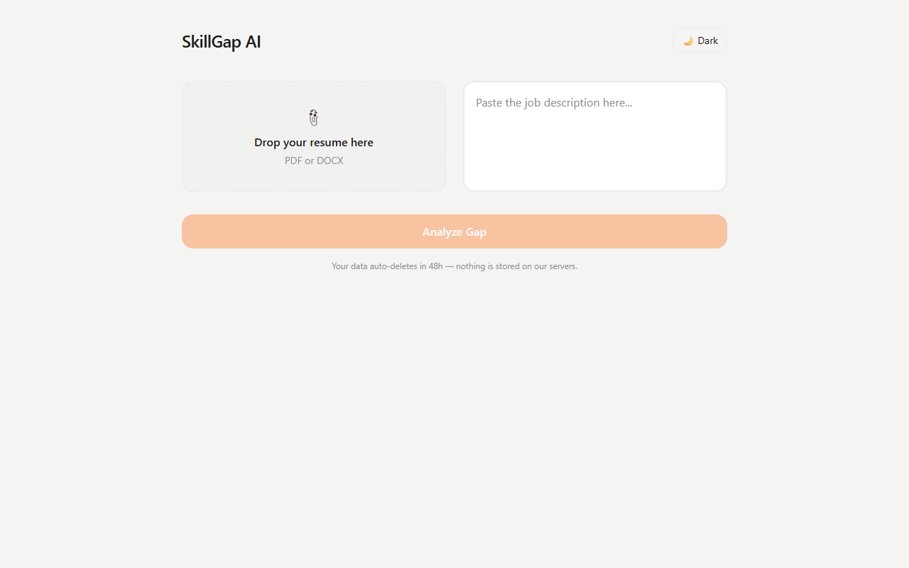
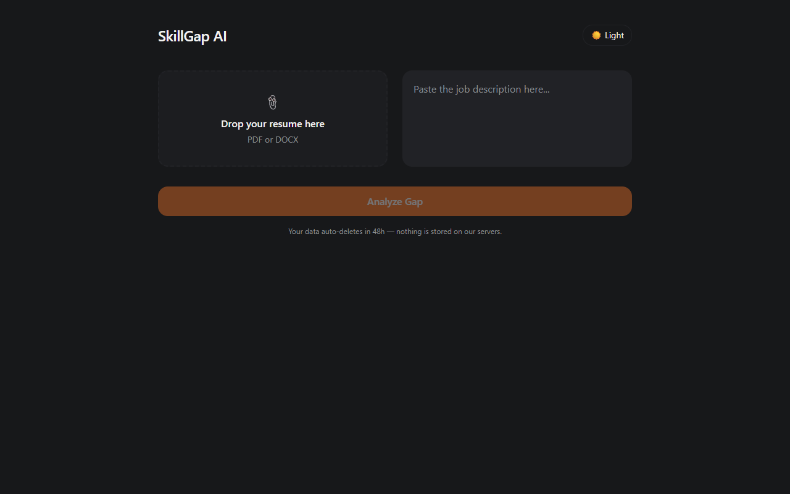
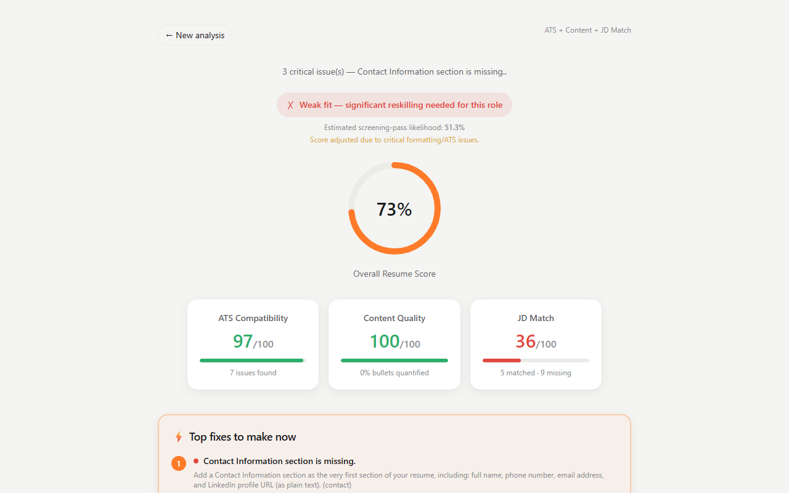
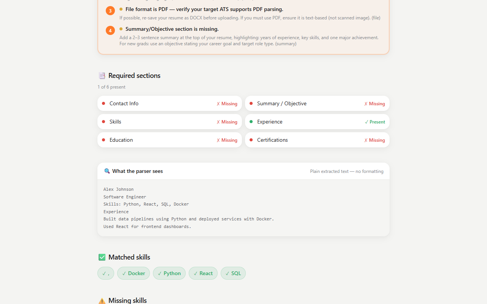

<p align="center">
  
</p>

<h1 align="center">SkillGap AI — Resume Intelligence Engine</h1>

<p align="center">
  <b>NLP-powered resume vs. job description skill-gap analysis.</b><br/>
  Upload your resume, paste a job description, and get an actionable report on how to close the gap.
</p>

<p align="center">
  
  
  
  
  
  
</p>

---

## 📖 Overview

SkillGap AI is a **privacy-first, cloud-native web service** that uses NLP to compare a resume against a job description. Instead of a naive keyword counter, it performs **semantic skill matching**, surfaces **matched / missing / bonus skills**, scores the gap, and recommends what to learn next.

It scores your resume across **three independent engines**:

| Engine | What it measures | Weight (default) |
|---|---|---|
| 🧩 **ATS Compatibility** | Can the file be parsed correctly — structure, formatting, sections | 30% |
| ✍️ **Content Quality** | Is the writing itself strong — verbs, quantification, achievement vs. duty | 30% |
| 🎯 **JD Match** | How well your skills match the job description | 40% |

When no JD is provided, the system runs in **pure resume analysis mode**: JD Match is skipped and the overall score re-weights to ATS 50% / Content 50%.

---

## ✨ Features

- **Hybrid skill extraction** — taxonomy matching (~450-skill ontology) fused with a fine-tuned `distilbert-base-uncased` NER model to recall skills outside the taxonomy.
- **Semantic matching** — sentence-transformer embeddings (`all-MiniLM-L6-v2`) recognize synonyms and abbreviations (e.g. `ML` ≈ `Machine Learning`, `K8s` ≈ `Kubernetes`).
- **Three independent scores** — ATS, Content Quality, and JD Match, weighted via JSON config (not hardcoded).
- **Actionable findings** — prioritized, severity-bucketed fixes with before/after examples and curated learning resources.
- **Privacy by design** — files are parsed in-memory and never written to disk; results cached anonymously for 48h.
- **Dark / light theme** with `prefers-color-scheme` support and `prefers-reduced-motion` respect.
- **Responsive UI** — React + Vite + Tailwind + Framer Motion, polished at mobile/tablet/desktop widths.

---

## 📸 Screenshots

<p align="center">
  
  
</p>

<p align="center"><i>Upload page — light & dark</i></p>

<p align="center">
  
  
</p>

<p align="center"><i>Results page — score ring, eligibility band, and detailed findings</i></p>

---

## 🏗️ Architecture

```
┌──────────────────────────────┐        ┌──────────────────────────────────┐
│         FRONTEND (SPA)        │ HTTPS  │            BACKEND (API)         │
│  React + Vite + Tailwind      │◄──────►│  FastAPI (Python) — stateless   │
│  IndexedDB (2-day TTL cache)  │  JSON  │  NLP pipeline (async workers)   │
│  Framer Motion animations     │        │  Redis (ephemeral cache, TTL)   │
│  Dark/Light theme             │        │  No permanent document storage  │
└──────────────────────────────┘        └──────────────────────────────────┘
        Deployed: Vercel/Netlify/            Deployed: Cloud Run / Fargate
        Firebase Hosting (CDN)                (containers, auto-scale to 0)
```

**Design principle — "Stateless by default, ephemeral by design":**

1. Resume/JD files are parsed **in-memory** on the backend. The raw file is never written to disk.
2. The browser is the only place data persists — **IndexedDB** with a 48h TTL, swept on every app load.
3. An optional **Redis** cache (TTL = 48h) stores only the *anonymized* analysis result (keyed by a random session UUID), so a user can revisit a past comparison without re-uploading.

---

## 🧠 NLP Pipeline

Multi-stage pipeline balancing accuracy and speed:

1. **Ingestion & parsing** — PDF via `pdfplumber`, DOCX via `python-docx`, fallback OCR (`pytesseract`) for scanned PDFs.
2. **Preprocessing** — spaCy (`en_core_web_sm`) tokenization, lemmatization, POS tagging.
3. **Skill extraction** — hybrid approach:
   - **Taxonomy matching** — `PhraseMatcher`/Aho-Corasick against a curated ~450-skill ontology with alias resolution (`JS` → `JavaScript`).
   - **Model-based NER** — a `distilbert-base-uncased` token-classification model trained on ~3.2k BIO-labeled examples, fused with taxonomy matching to catch out-of-taxonomy skills.
4. **Semantic normalization & matching** — embeddings + cosine similarity above a calibrated threshold (`0.57`).
5. **Importance weighting** — TF-IDF / frequency-of-mention, plus a boost for "must-have" sections.
6. **Recommendation layer** — missing skills ranked by (importance × ease-of-learning), mapped to curated learning resources.

---

## 🛠️ Tech Stack

**Backend**

- Python 3.11, FastAPI 0.115, Pydantic v2
- spaCy, sentence-transformers, scikit-learn
- Redis (ephemeral cache), python-docx, pdfplumber, pytesseract

**Frontend**

- React 18.3, TypeScript 5.5, Vite 5.4
- Tailwind CSS 3.4, Framer Motion 11

**Infra**

- Docker / docker-compose
- Kubernetes manifests (`infra/k8s/`), Terraform (`infra/terraform/`)

---

## 🚀 Quick Start (Local Dev)

### Prerequisites

- Python 3.11
- Node.js 20+
- spaCy model: `python -m spacy download en_core_web_sm`
- *(optional)* semantic matching: `pip install sentence-transformers`
- *(optional)* OCR of scanned PDFs: `pip install pytesseract pypdfium2` + tesseract binary

### Backend

```bash
cd backend
pip install -r requirements.txt
uvicorn app.main:app --reload --port 8080
```

### Frontend

```bash
cd frontend
npm install
npm run dev
```

Frontend → http://localhost:5173
Backend Swagger docs → http://localhost:8080/docs

### Docker (everything at once)

```bash
cd infra/docker
docker compose up --build
```

---

## 🧪 Testing

```bash
# Backend unit/integration tests
cd backend && python -m pytest -q

# Frontend unit tests (vitest + RTL)
cd frontend && npm run test

# TypeScript typecheck
cd frontend && npm run typecheck

# E2E (Playwright) — boots backend + frontend automatically
# requires: npx playwright install chromium
cd frontend && npm run e2e
```

---

## 📁 Project Structure

```
NLP-SKILL GAP ANALYZER/
├── backend/
│   ├── app/
│   │   ├── api/            # versioned route handlers (v1 endpoints)
│   │   ├── core/           # config, logging, settings
│   │   ├── services/       # resume parser, skill extractor, matcher, scoring
│   │   ├── nlp/            # semantic matcher, proficiency estimation
│   │   ├── analysis/       # gap engine, priority engine
│   │   ├── ml/             # NER model, distant supervision, evaluation
│   │   ├── models/         # Pydantic schemas
│   │   └── main.py         # FastAPI app assembly
│   ├── scripts/            # threshold calibration, pipeline evaluation
│   ├── tests/              # pytest suite + fixtures
│   └── requirements.txt
├── frontend/
│   ├── src/
│   │   ├── components/     # ScoreRing, SkillChip, PipelineStepper, FindingsList, ...
│   │   ├── pages/          # UploadPage, ResultsPage
│   │   ├── context/        # ThemeContext
│   │   ├── lib/            # API client, IndexedDB TTL store
│   │   ├── types/          # shared TypeScript types
│   │   └── styles/         # Tailwind entry
│   ├── e2e/                # Playwright tests
│   └── package.json
├── infra/
│   ├── docker/             # docker-compose.yml
│   ├── k8s/                # Kubernetes manifests
│   └── terraform/          # Infrastructure as code
├── docs/
│   ├── MASTER_PLAN.md      # full architecture & product vision
│   ├── MODEL_EVALUATION.md # measured evaluation results
│   ├── NER_MODEL_GUIDE.md  # NER training guide
│   ├── NO_JD_SPEC.md       # no-JD mode specification
│   ├── BUILD_EXECUTION_PLAN.md # build roadmap
│   └── images/             # README screenshots & logo
└── README.md
```

---

## 🧮 Score Weighting

Sub-scores are weighted independently and configured via JSON, not hardcoded. Defaults:

```
ATS 30% · Content 30% · JD Match 40%
```

Stored in `backend/app/core/config.py`, overridable per-session via the API. When no JD is provided, the `overall_score` re-weights automatically to ATS + Content only (**50/50**).

---

## 🔒 Data Privacy Model

| Layer | What's stored | TTL | Mechanism |
|---|---|---|---|
| **Browser** (IndexedDB) | Parsed text, extracted skills, analysis result | 48h | Sweep-on-load + `expiresAt` check |
| **Backend** (Redis) | Anonymized analysis JSON (random session UUID) | 48h | Native `EX 172800` key expiry |
| **Backend** (disk) | **Nothing.** Files exist only as an in-memory buffer | 0 | Never written to disk |

The UI states this clearly: *"Your data auto-deletes in 48h — nothing is stored on our servers."*

---

## 📊 Evaluation

Real measured results from the evaluation harness (`backend/scripts/evaluate_pipeline.py`) — see [`docs/MODEL_EVALUATION.md`](docs/MODEL_EVALUATION.md) for the full report.

| Strategy | Precision | Recall | F1 |
|---|---|---|---|
| Lexical (exact string) | 1.000 | 0.056 | 0.105 |
| Semantic (embeddings only) | 0.913 | 0.583 | **0.712** |
| Hybrid (lexical + embeddings) | 0.913 | 0.583 | **0.712** |

The `skill_match_threshold` is **calibrated (0.57)** on a labeled skill-pair set via an F1 sweep — not guessed. The previous hardcoded value (0.78) yielded F1 = 0.391.

---

## 📚 Documentation

- [`docs/MASTER_PLAN.md`](docs/MASTER_PLAN.md) — architecture, NLP pipeline, UI/UX design system, cloud-native deployment plan
- [`docs/MODEL_EVALUATION.md`](docs/MODEL_EVALUATION.md) — measured evaluation results
- [`docs/NER_MODEL_GUIDE.md`](docs/NER_MODEL_GUIDE.md) — training the fine-tuned Skill-NER model
- [`docs/NO_JD_SPEC.md`](docs/NO_JD_SPEC.md) — no-JD mode specification
- [`docs/BUILD_EXECUTION_PLAN.md`](docs/BUILD_EXECUTION_PLAN.md) — build roadmap with definition of done

---

## 🤝 Contributing

Contributions are welcome! Please follow the engineering standards outlined in [`docs/BUILD_EXECUTION_PLAN.md`](docs/BUILD_EXECUTION_PLAN.md):

- Trunk-based development with short-lived feature branches
- Conventional commits (`feat:`, `fix:`, `test:`, `docs:`, `chore:`)
- Every service module ships with a matching test file
- No secrets in code or committed `.env`

---

## 📄 License

MIT © SkillGap AI Contributors
